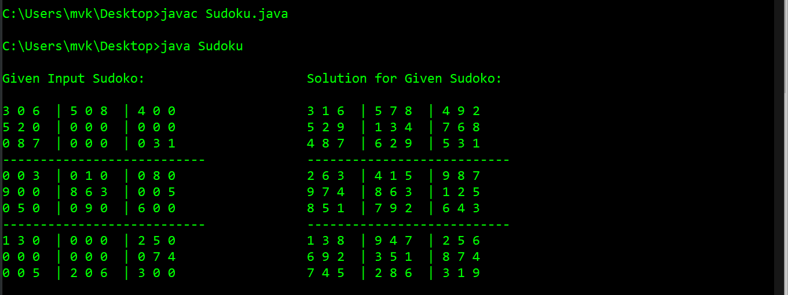

# Sudoku-Puzzle
Solving Sudoku Problem using Backtracking 

* Sudoku is a logic-based, combinatorial number-placement puzzle. 
* The objective is to fill a 9×9 grid with digits so that each column, each row, and each of the nine 3×3 subgrids that compose the grid contain all of the digits from 1 to 9.
* In Backtracking we try to find the possibilty to place the number in the 9 X 9 Grid.
* The Working of Sudoku of JAVA source code attached is commented line by line.
* Assuming '0' in the input grid as the number to be filled.

## Output :

* The above is the output of the Sudoku Puzzle before and after been solved with reference to the 9 X 9 Grid.

### Requirements to run the Java Program

- JDK (JDK 1.5 or above)
- JRE 

                                                     Happy Coding :)
